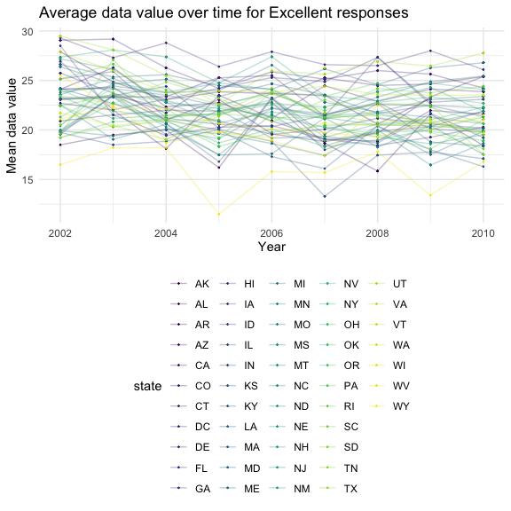
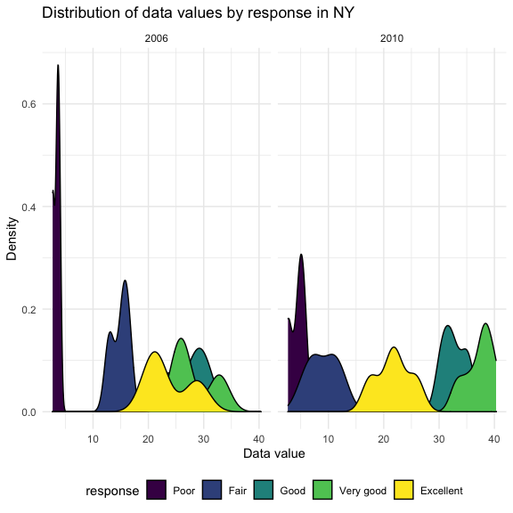
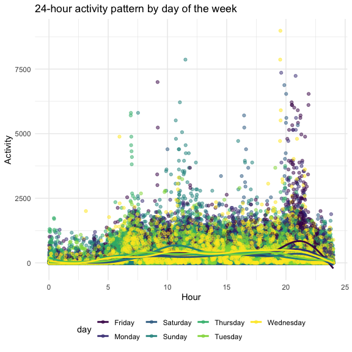

P8105 Homework 3
================
Heidi Lumish

## Problem 1

First we will load in the Instacart data from the p8105.datasets
library.

``` r
data("instacart")
```

#### Summary of the Instacart dataset

Next, we will summarize the dataset.

The Instacart dataset provides detailed information on grocery orders in
2017. The dataset has 15 variables, and it describes 1384617 products
from 131209 unique users. 59.86% products had been ordered by the user
in the past. The median time since the prior order for each customer was
15 (IQR 7, 30) days. There were 39123 unique products ordered from 134
different aisles.

### Specifics of the Instacart dataset

#### How many aisles are there, and which aisles are the most items ordered from?

There are 134 aisles, and the most items are ordered from aisle. Using
the following code chunk, we can determine that the most items are
ordered from the aisle fresh vegetables, fresh fruits, packaged
vegetables, yogurt, and packaged cheese.

``` r
instacart %>% 
  group_by(aisle) %>% 
  summarize(
    aisle_count = n()
  ) %>% 
  slice_max(aisle_count, n = 5)
```

    ## # A tibble: 5 × 2
    ##   aisle                      aisle_count
    ##   <chr>                            <int>
    ## 1 fresh vegetables                150609
    ## 2 fresh fruits                    150473
    ## 3 packaged vegetables fruits       78493
    ## 4 yogurt                           55240
    ## 5 packaged cheese                  41699

#### Plot showing the number of items ordered in each aisle

``` r
instacart %>% 
  group_by(aisle) %>% 
  summarize(
    aisle_count = n()
  ) %>% 
  filter(aisle_count >10000) %>% 
  ggplot(aes(x = reorder(aisle, aisle_count), y = aisle_count)) +
  geom_col(width = 0.7) +
  coord_flip() + 
  labs(
    title = "Number of products ordered per aisle",
    x = "Aisle name",
    y = "Number of products")
```


#### Table of three most popular items

Make a table showing the three most popular items in each of the aisles
“baking ingredients”, “dog food care”, and “packaged vegetables fruits”.
Include the number of times each item is ordered in your table.

``` r
instacart %>% 
  filter(
    aisle == "baking ingredients" |
      aisle == "dog food care" |
      aisle == "packaged vegetables fruits") %>%
  group_by(product_name) %>% 
  mutate(
    product_count = n()) %>%
  select(aisle, product_name, product_count) %>% 
  distinct() %>% 
  group_by(aisle) %>%
  slice_max(product_count, n = 3) %>% 
  mutate(
    Rank = order(product_count, decreasing = TRUE)
  ) %>%
  unite("product", product_name, product_count, sep = ": ") %>% 
  mutate(
    aisle = str_to_title(aisle)
  ) %>% 
  pivot_wider(
    names_from = "aisle",
    values_from = "product"
    ) %>% 
  knitr::kable(format = "simple",
               caption = "Top three most popular items by aisle")
```

| Rank | Baking Ingredients     | Dog Food Care                                     | Packaged Vegetables Fruits |
|-----:|:-----------------------|:--------------------------------------------------|:---------------------------|
|    1 | Light Brown Sugar: 499 | Snack Sticks Chicken & Rice Recipe Dog Treats: 30 | Organic Baby Spinach: 9784 |
|    2 | Pure Baking Soda: 387  | Organix Chicken & Brown Rice Recipe: 28           | Organic Raspberries: 5546  |
|    3 | Cane Sugar: 336        | Small Dog Biscuits: 26                            | Organic Blueberries: 4966  |

Top three most popular items by aisle

#### Pink Lady Apples and Coffee Ice Cream

The following is a table showing the mean hour of the day at which Pink
Lady Apples and Coffee Ice Cream are ordered on each day of the week.

``` r
instacart %>% 
  filter(
    product_name == "Pink Lady Apples" |
    product_name == "Coffee Ice Cream") %>% 
  group_by(product_name, order_dow) %>% 
  summarize(
    mean_hour = round(mean(order_hour_of_day), digits = 1)
  ) %>% 
  mutate(Day = case_when(
    order_dow == 0 ~ "Sunday",
    order_dow == 1 ~ "Monday",
    order_dow == 2 ~ "Tuesday",
    order_dow == 3 ~ "Wednesday",
    order_dow == 4 ~ "Thursday",
    order_dow == 5 ~ "Friday",
    order_dow == 6 ~ "Saturday")
  ) %>% 
  pivot_wider(
    names_from = "product_name",
    values_from = "mean_hour"
  ) %>% 
  select(-order_dow) %>% 
    knitr::kable(format = "simple",
                 caption = "Mean hour for ordering products by day of the week")
```

    ## `summarise()` has grouped output by 'product_name'. You can override using the `.groups` argument.

| Day       | Coffee Ice Cream | Pink Lady Apples |
|:----------|-----------------:|-----------------:|
| Sunday    |             13.8 |             13.4 |
| Monday    |             14.3 |             11.4 |
| Tuesday   |             15.4 |             11.7 |
| Wednesday |             15.3 |             14.2 |
| Thursday  |             15.2 |             11.6 |
| Friday    |             12.3 |             12.8 |
| Saturday  |             13.8 |             11.9 |

Mean hour for ordering products by day of the week

## Problem 2

#### Load and clean the BRFSS dataset

First we will load the BRFSS dataset from the p8105.datasets package.

``` r
data("brfss_smart2010")
```

Next we will clean the data.

``` r
brfss = brfss_smart2010 %>% 
  janitor::clean_names() %>% 
  mutate(
    state = locationabbr,
    county = locationdesc
  ) %>% 
  select(-locationabbr, -locationdesc) %>% 
  relocate(year, state, county) %>% 
  filter(topic == "Overall Health") %>% 
  filter(response %in% c("Poor", "Fair", "Good", "Very Good", "Excellent")) %>%
  mutate(
    response = factor(response, levels = c("Poor", "Fair", "Good", "Very Good", "Excellent"))
  )
```

#### BRFSS dataset questions

In 2002, which states were observed at 7 or more locations? What about
in 2010?

``` r
brfss %>% 
  filter(year == "2002") %>%
  select(state, county) %>% 
  distinct() %>% 
  group_by(state) %>% 
  summarize(count = n()) %>% 
  filter(count >= 7)
```

    ## # A tibble: 6 × 2
    ##   state count
    ##   <chr> <int>
    ## 1 CT        7
    ## 2 FL        7
    ## 3 MA        8
    ## 4 NC        7
    ## 5 NJ        8
    ## 6 PA       10

``` r
brfss %>% 
  filter(year == "2010") %>%
  select(state, county) %>% 
  distinct() %>% 
  group_by(state) %>% 
  summarize(count = n()) %>% 
  filter(count >= 7)
```

    ## # A tibble: 14 × 2
    ##    state count
    ##    <chr> <int>
    ##  1 CA       12
    ##  2 CO        7
    ##  3 FL       41
    ##  4 MA        9
    ##  5 MD       12
    ##  6 NC       12
    ##  7 NE       10
    ##  8 NJ       19
    ##  9 NY        9
    ## 10 OH        8
    ## 11 PA        7
    ## 12 SC        7
    ## 13 TX       16
    ## 14 WA       10

Construct a dataset that is limited to Excellent responses, and
contains, year, state, and a variable that averages the data\_value
across locations within a state. Make a “spaghetti” plot of this average
value over time within a state (that is, make a plot showing a line for
each state across years – the geom\_line geometry and group aesthetic
will help).

``` r
excellent = brfss %>% 
  filter(response == "Excellent") %>% 
  group_by(state, year) %>% 
  mutate(
    mean_data_value = mean(data_value)
  ) %>% 
  select(year, state, mean_data_value)

excellent %>% 
  ggplot(aes(x = year, y = mean_data_value, color = state)) +
  geom_point(size = .2) + 
  geom_line(aes(group = state), alpha = .3)
```

    ## Warning: Removed 71 rows containing missing values (geom_point).

    ## Warning: Removed 65 row(s) containing missing values (geom_path).



Make a two-panel plot showing, for the years 2006, and 2010,
distribution of data\_value for responses (“Poor” to “Excellent”) among
locations in NY State.

``` r
brfss %>% 
  filter(
    year == c("2006", "2010"),
    state == "NY") %>% 
  ggplot(aes(x = response, y = data_value, color = county)) +
  geom_point() + 
  facet_grid(.~year)
```



## Problem 3

This problem uses five weeks of accelerometer data collected on a 63
year-old male with BMI 25, who was admitted to the Advanced Cardiac Care
Center of Columbia University Medical Center and diagnosed with
congestive heart failure (CHF). The data can be downloaded here. In this
spreadsheet, variables activity.\* are the activity counts for each
minute of a 24-hour day starting at midnight.

Load, tidy, and otherwise wrangle the data. Your final dataset should
include all originally observed variables and values; have useful
variable names; include a weekday vs weekend variable; and encode data
with reasonable variable classes.

First we will load in and tidy the accelerometer data.

``` r
accel = read_csv("./data/accel_data.csv") %>% 
  janitor::clean_names() %>% 
  mutate(
    day_type = case_when(
      day == "Sunday" ~ "weekend",
      day == "Monday" ~ "weekday",
      day == "Tuesday" ~ "weekday",
      day == "Wednesday" ~ "weekday",
      day == "Thursday" ~ "weekday",
      day == "Friday" ~ "weekday",
      day == "Saturday" ~ "weekend")
  ) %>% 
  pivot_longer(
    activity_1:activity_1440,
    names_to = "activity",
    names_prefix = "activity_",
    values_to = "counts"
  )
```

    ## Rows: 35 Columns: 1443

    ## ── Column specification ────────────────────────────────────────────────────────
    ## Delimiter: ","
    ## chr    (1): day
    ## dbl (1442): week, day_id, activity.1, activity.2, activity.3, activity.4, ac...

    ## 
    ## ℹ Use `spec()` to retrieve the full column specification for this data.
    ## ℹ Specify the column types or set `show_col_types = FALSE` to quiet this message.

Describe the resulting dataset (e.g. what variables exist, how many
observations, etc).

Traditional analyses of accelerometer data focus on the total activity
over the day. Using your tidied dataset, aggregate across minutes to
create a total activity variable for each day, and create a table
showing these totals. Are any trends apparent?

``` r
accel %>% 
  group_by(day_id) %>% 
  mutate(total_activity = sum(counts)) %>% 
  ungroup() %>% 
  select(week, day, total_activity) %>% 
  distinct() %>% 
  pivot_wider(
    names_from = "day",
    values_from = "total_activity"
  )
```

    ## # A tibble: 5 × 8
    ##    week  Friday  Monday Saturday Sunday Thursday Tuesday Wednesday
    ##   <dbl>   <dbl>   <dbl>    <dbl>  <dbl>    <dbl>   <dbl>     <dbl>
    ## 1     1 480543.  78828.   376254 631105  355924. 307094.   340115.
    ## 2     2 568839  295431    607175 422018  474048  423245    440962 
    ## 3     3 467420  685910    382928 467052  371230  381507    468869 
    ## 4     4 154049  409450      1440 260617  340291  319568    434460 
    ## 5     5 620860  389080      1440 138421  549658  367824    445366

Accelerometer data allows the inspection activity over the course of the
day. Make a single-panel plot that shows the 24-hour activity time
courses for each day and use color to indicate day of the week. Describe
in words any patterns or conclusions you can make based on this graph.

``` r
accel %>% 
  ggplot(aes(x = day_id, y = counts, color = day, shape = day_type)) + 
  geom_point()
```


