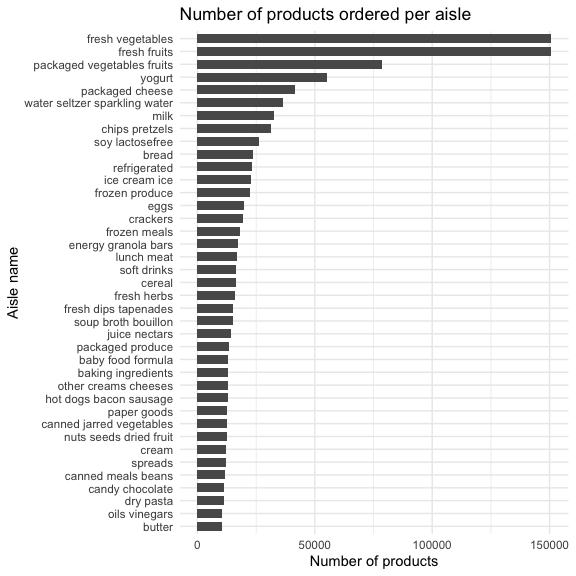

P8105 Homework 3
================
Heidi Lumish

## Problem 1

First we will load in the Instacart data from the p8105.datasets
library.

``` r
data("instacart")
```

#### Summary of the Instacart dataset

Next, we will summarize the dataset.

The Instacart dataset provides detailed information on grocery orders in
2017. The dataset has 15 variables, and it describes 1384617 products
from 131209 unique users. 59.86% products had been ordered by the user
in the past. The median time since the prior order for each customer was
15 (IQR 7, 30) days. There were 39123 unique products ordered from 134
different aisles.

### Specifics of the Instacart dataset

#### How many aisles are there, and which aisles are the most items ordered from?

There are 134 aisles, and the most items are ordered from aisle. Using
the following code chunk, we can determine that the most items are
ordered from the aisle fresh vegetables, fresh fruits, packaged
vegetables, yogurt, and packaged cheese.

``` r
instacart %>% 
  group_by(aisle) %>% 
  summarize(
    aisle_count = n()
  ) %>% 
  slice_max(aisle_count, n = 5)
```

    ## # A tibble: 5 × 2
    ##   aisle                      aisle_count
    ##   <chr>                            <int>
    ## 1 fresh vegetables                150609
    ## 2 fresh fruits                    150473
    ## 3 packaged vegetables fruits       78493
    ## 4 yogurt                           55240
    ## 5 packaged cheese                  41699

#### Plot showing the number of items ordered in each aisle

``` r
instacart %>% 
  group_by(aisle) %>% 
  summarize(
    aisle_count = n()
  ) %>% 
  filter(aisle_count >10000) %>% 
  ggplot(aes(x = reorder(aisle, aisle_count), y = aisle_count)) +
  geom_col(width = 0.7) +
  coord_flip() + 
  labs(
    title = "Number of products ordered per aisle",
    x = "Aisle name",
    y = "Number of products")
```



#### Table of three most popular items

Make a table showing the three most popular items in each of the aisles
“baking ingredients”, “dog food care”, and “packaged vegetables fruits”.
Include the number of times each item is ordered in your table.

``` r
instacart %>% 
  filter(
    aisle == "baking ingredients" |
      aisle == "dog food care" |
      aisle == "packaged vegetables fruits") %>%
  group_by(product_name) %>% 
  mutate(
    product_count = n()) %>%
  select(aisle, product_name, product_count) %>% 
  distinct() %>% 
  group_by(aisle) %>%
  slice_max(product_count, n = 3) %>% 
  mutate(
    Rank = order(product_count, decreasing = TRUE)
  ) %>%
  unite("product", product_name, product_count, sep = ": ") %>% 
  mutate(
    aisle = str_to_title(aisle)
  ) %>% 
  pivot_wider(
    names_from = "aisle",
    values_from = "product"
    ) %>% 
  knitr::kable(format = "simple",
               caption = "Top three most popular items by aisle")
```

| Rank | Baking Ingredients     | Dog Food Care                                     | Packaged Vegetables Fruits |
|-----:|:-----------------------|:--------------------------------------------------|:---------------------------|
|    1 | Light Brown Sugar: 499 | Snack Sticks Chicken & Rice Recipe Dog Treats: 30 | Organic Baby Spinach: 9784 |
|    2 | Pure Baking Soda: 387  | Organix Chicken & Brown Rice Recipe: 28           | Organic Raspberries: 5546  |
|    3 | Cane Sugar: 336        | Small Dog Biscuits: 26                            | Organic Blueberries: 4966  |

Top three most popular items by aisle

#### Pink Lady Apples and Coffee Ice Cream

The following is a table showing the mean hour of the day at which Pink
Lady Apples and Coffee Ice Cream are ordered on each day of the week.

``` r
instacart %>% 
  filter(
    product_name == "Pink Lady Apples" |
    product_name == "Coffee Ice Cream") %>% 
  group_by(product_name, order_dow) %>% 
  summarize(
    mean_hour = round(mean(order_hour_of_day), digits = 1)
  ) %>% 
  mutate(Day = case_when(
    order_dow == 0 ~ "Sunday",
    order_dow == 1 ~ "Monday",
    order_dow == 2 ~ "Tuesday",
    order_dow == 3 ~ "Wednesday",
    order_dow == 4 ~ "Thursday",
    order_dow == 5 ~ "Friday",
    order_dow == 6 ~ "Saturday")
  ) %>% 
  pivot_wider(
    names_from = "product_name",
    values_from = "mean_hour"
  ) %>% 
  select(-order_dow) %>% 
    knitr::kable(format = "simple",
                 caption = "Mean hour for ordering products by day of the week")
```

    ## `summarise()` has grouped output by 'product_name'. You can override using the `.groups` argument.

| Day       | Coffee Ice Cream | Pink Lady Apples |
|:----------|-----------------:|-----------------:|
| Sunday    |             13.8 |             13.4 |
| Monday    |             14.3 |             11.4 |
| Tuesday   |             15.4 |             11.7 |
| Wednesday |             15.3 |             14.2 |
| Thursday  |             15.2 |             11.6 |
| Friday    |             12.3 |             12.8 |
| Saturday  |             13.8 |             11.9 |

Mean hour for ordering products by day of the week
