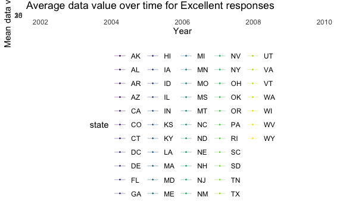
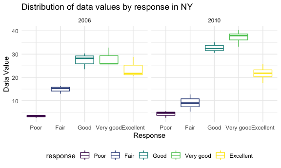
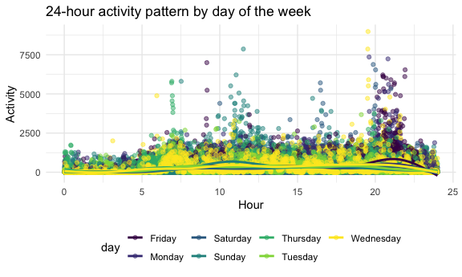
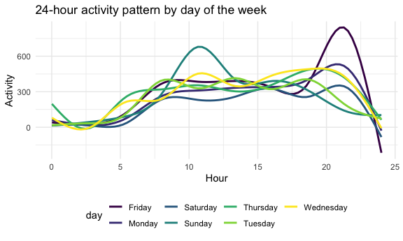

P8105 Homework 3
================
Heidi Lumish

## Problem 1

#### Load the Instacart dataset

First we will load in the Instacart data from the p8105.datasets
library.

``` r
data("instacart")
```

#### Summary of the Instacart dataset

Next, we will summarize the dataset.

The Instacart dataset provides detailed information on grocery orders in
2017. The dataset has 15 variables, and it describes 1384617 products
from 131209 unique users. 59.86% products had been ordered by the user
in the past. The median time since the prior order for each customer was
15 (IQR 7, 30) days. There were 39123 unique products ordered from 134
different aisles.

### Specifics of the Instacart dataset

#### How many aisles are there, and which aisles are the most items ordered from?

There are 134 aisles. Using the following code chunk, we can determine
that the most items are ordered from the aisles fresh vegetables, fresh
fruits, packaged vegetables, yogurt, and packaged cheese.

``` r
instacart %>% 
  group_by(aisle) %>% 
  summarize(
    aisle_count = n()
  ) %>% 
  slice_max(aisle_count, n = 5)
```

    ## # A tibble: 5 × 2
    ##   aisle                      aisle_count
    ##   <chr>                            <int>
    ## 1 fresh vegetables                150609
    ## 2 fresh fruits                    150473
    ## 3 packaged vegetables fruits       78493
    ## 4 yogurt                           55240
    ## 5 packaged cheese                  41699

#### Plot showing the number of items ordered in each aisle

Next we will make a plot that shows the number of items ordered in each
aisle, limiting this to aisles with more than 10000 items ordered.

``` r
instacart %>% 
  group_by(aisle) %>% 
  summarize(
    aisle_count = n()
  ) %>% 
  filter(aisle_count >10000) %>% 
  ggplot(aes(x = reorder(aisle, aisle_count), y = aisle_count)) +
  geom_col(width = 0.7) +
  coord_flip() + 
  labs(
    title = "Number of products ordered per aisle",
    x = "Aisle name",
    y = "Number of products")
```


This plot again demonstrates that the most items are ordered from the
aisles mentioned above.

#### Table of three most popular items

Now we will make a table showing the three most popular items in each of
the aisles “baking ingredients”, “dog food care”, and “packaged
vegetables fruits”. Included in the table is the number of times each
item is ordered.

``` r
instacart %>% 
  filter(
    aisle == "baking ingredients" |
      aisle == "dog food care" |
      aisle == "packaged vegetables fruits") %>%
  group_by(product_name) %>% 
  mutate(
    product_count = n()) %>%
  select(aisle, product_name, product_count) %>% 
  distinct() %>% 
  group_by(aisle) %>%
  slice_max(product_count, n = 3) %>% 
  mutate(
    Rank = order(product_count, decreasing = TRUE)
  ) %>%
  unite("product", product_name, product_count, sep = ": ") %>% 
  mutate(
    aisle = str_to_title(aisle)
  ) %>% 
  pivot_wider(
    names_from = "aisle",
    values_from = "product"
    ) %>% 
  knitr::kable(format = "simple",
               caption = "Top three most popular items by aisle with number of items ordered")
```

| Rank | Baking Ingredients     | Dog Food Care                                     | Packaged Vegetables Fruits |
|-----:|:-----------------------|:--------------------------------------------------|:---------------------------|
|    1 | Light Brown Sugar: 499 | Snack Sticks Chicken & Rice Recipe Dog Treats: 30 | Organic Baby Spinach: 9784 |
|    2 | Pure Baking Soda: 387  | Organix Chicken & Brown Rice Recipe: 28           | Organic Raspberries: 5546  |
|    3 | Cane Sugar: 336        | Small Dog Biscuits: 26                            | Organic Blueberries: 4966  |

Top three most popular items by aisle with number of items ordered

We can see that the top items ordered are light brown sugar for baking
ingredients, snack sticks for dog food care, and organic baby spinach
for packaged vegetables and fruits.

#### Pink Lady Apples and Coffee Ice Cream

The following is a table showing the mean hour of the day at which Pink
Lady Apples and Coffee Ice Cream are ordered on each day of the week.

``` r
instacart %>% 
  filter(
    product_name == "Pink Lady Apples" |
    product_name == "Coffee Ice Cream") %>% 
  group_by(product_name, order_dow) %>% 
  summarize(
    mean_hour = round(mean(order_hour_of_day), digits = 1)
  ) %>% 
  mutate(Day = case_when(
    order_dow == 0 ~ "Sunday",
    order_dow == 1 ~ "Monday",
    order_dow == 2 ~ "Tuesday",
    order_dow == 3 ~ "Wednesday",
    order_dow == 4 ~ "Thursday",
    order_dow == 5 ~ "Friday",
    order_dow == 6 ~ "Saturday")
  ) %>% 
  pivot_wider(
    names_from = "product_name",
    values_from = "mean_hour"
  ) %>% 
  select(-order_dow) %>% 
    knitr::kable(format = "simple",
                 caption = "Mean hour for ordering products by day of the week")
```

    ## `summarise()` has grouped output by 'product_name'. You can override using the `.groups` argument.

| Day       | Coffee Ice Cream | Pink Lady Apples |
|:----------|-----------------:|-----------------:|
| Sunday    |             13.8 |             13.4 |
| Monday    |             14.3 |             11.4 |
| Tuesday   |             15.4 |             11.7 |
| Wednesday |             15.3 |             14.2 |
| Thursday  |             15.2 |             11.6 |
| Friday    |             12.3 |             12.8 |
| Saturday  |             13.8 |             11.9 |

Mean hour for ordering products by day of the week

We can see that overall, on average, coffee ice cream is ordered later
in the day than Pink Lady apples.

## Problem 2

### Load and clean the BRFSS dataset

First we will load the BRFSS dataset from the p8105.datasets package.

``` r
data("brfss_smart2010")
```

Next we will clean the data. This includes limiting the data set to the
“Overall Health” topic, including only responses from “Excellent” to
“Poor,” and organizing responses as a factor taking levels ordered from
“Poor” to “Excellent.”

``` r
brfss = brfss_smart2010 %>% 
  janitor::clean_names() %>% 
  mutate(
    state = locationabbr,
    county = locationdesc
  ) %>% 
  select(-locationabbr, -locationdesc) %>% 
  relocate(year, state, county) %>% 
  filter(topic == "Overall Health") %>% 
  filter(response %in% c("Poor", "Fair", "Good", "Very good", "Excellent")) %>%
  mutate(
    response = factor(response, levels = c("Poor", "Fair", "Good", "Very good", "Excellent"))
  )
```

### BRFSS dataset questions

#### Observed at 7 or more locations

In 2002, which states were observed at 7 or more locations? What about
in 2010?

Based on the code chunk below, we can see that the there were 6 states
(CT, FL, MA, NC, NJ, and PA) that were observed at 7 or more locations
in 2002. By comparison, in 2010, there 14 states (CA, CO, FL, MA, MD,
NC, NE, NJ, NY, OH, PA, SC, TX, and WA) that were observed at 7 or more
locations.

``` r
brfss %>% 
  filter(year == "2002") %>%
  select(state, county) %>% 
  distinct() %>% 
  group_by(state) %>% 
  summarize(count = n()) %>% 
  filter(count >= 7)
```

    ## # A tibble: 6 × 2
    ##   state count
    ##   <chr> <int>
    ## 1 CT        7
    ## 2 FL        7
    ## 3 MA        8
    ## 4 NC        7
    ## 5 NJ        8
    ## 6 PA       10

``` r
brfss %>% 
  filter(year == "2010") %>%
  select(state, county) %>% 
  distinct() %>% 
  group_by(state) %>% 
  summarize(count = n()) %>% 
  filter(count >= 7)
```

    ## # A tibble: 14 × 2
    ##    state count
    ##    <chr> <int>
    ##  1 CA       12
    ##  2 CO        7
    ##  3 FL       41
    ##  4 MA        9
    ##  5 MD       12
    ##  6 NC       12
    ##  7 NE       10
    ##  8 NJ       19
    ##  9 NY        9
    ## 10 OH        8
    ## 11 PA        7
    ## 12 SC        7
    ## 13 TX       16
    ## 14 WA       10

#### Excellent responses

We will now construct a dataset that is limited to *Excellent* responses
and contains year, state, and a variable that averages the data\_value
across locations within a state. We will then make a “spaghetti” plot of
this average value over time within a state.

``` r
excellent = brfss %>% 
  filter(response == "Excellent") %>% 
  group_by(state, year) %>% 
  mutate(
    mean_data_value = mean(data_value)
  ) %>% 
  select(year, state, mean_data_value)

excellent %>% 
  ggplot(aes(x = year, y = mean_data_value, color = state)) +
  geom_point(size = .2) + 
  geom_line(aes(group = state), alpha = .3) +
  labs(
    title = "Average data value over time for Excellent responses",
    x = "Year",
    y = "Mean data value")
```

    ## Warning: Removed 71 rows containing missing values (geom_point).

    ## Warning: Removed 65 row(s) containing missing values (geom_path).



From the spaghetti plot, we can see that overall, the average data value
tended to decrease over time from 2002 to 2010.

#### Distribution of responses in 2006 and 2010 in NY state

We will now filter the data to include the years 2006 and 2010 only and
limit the dataset to NY state. The box plot below shows the distribution
of data\_value for responses (“Poor” to “Excellent”) among locations in
NY State.

``` r
brfss %>% 
  filter(
    year == c("2006", "2010"),
    state == "NY") %>% 
  ggplot(aes(x = response, y = data_value, color = response)) +
  geom_boxplot() + 
  facet_grid(.~year) +
  labs(
    title = "Distribution of data values by response in NY",
    x = "Response",
    y = "Data Value")
```

    ## Warning in year == c("2006", "2010"): longer object length is not a multiple of
    ## shorter object length



These box plots plot show that a response of “Poor” correlated with the
lowest data values, both in 2006 and 2010. A response of “Fair”
similarly correlated with lower data values, though not quite as low as
for “Poor.” In 2006, there was overlap between the data values for
“Good,” “Very good,” and “Excellent” responses. In 2010, the highest
data values coresponded with “Good” and “Very good” responses, whereas
data values for “Excellent” were slightly lower and were more similar to
the values in 2006.

## Problem 3

This problem uses five weeks of accelerometer data collected on a 63
year-old male with BMI 25, who was admitted to the Advanced Cardiac Care
Center of Columbia University Medical Center and diagnosed with
congestive heart failure (CHF). The variables include the activity
counts for each minute of a 24-hour day starting at midnight.

#### Load and tidy the accelerometer data

First we will load, tidy, and wrangle the accelerometer data. We will
add a variable specifying “weekday” vs. “weekend,” and we will use
pivot\_longer to create a variable for minute of the day and a separate
variable for the activity counts.

``` r
accel = read_csv("./data/accel_data.csv") %>% 
  janitor::clean_names() %>% 
  mutate(
    day_type = case_when(
      day == "Sunday" ~ "weekend",
      day == "Monday" ~ "weekday",
      day == "Tuesday" ~ "weekday",
      day == "Wednesday" ~ "weekday",
      day == "Thursday" ~ "weekday",
      day == "Friday" ~ "weekday",
      day == "Saturday" ~ "weekend"),
    week = as.numeric(as.character(week))
  ) %>% 
  pivot_longer(
    activity_1:activity_1440,
    names_to = "activity",
    names_prefix = "activity_",
    values_to = "counts"
  ) %>% 
  mutate(counts = as.numeric(counts))
```

    ## Rows: 35 Columns: 1443

    ## ── Column specification ────────────────────────────────────────────────────────
    ## Delimiter: ","
    ## chr    (1): day
    ## dbl (1442): week, day_id, activity.1, activity.2, activity.3, activity.4, ac...

    ## 
    ## ℹ Use `spec()` to retrieve the full column specification for this data.
    ## ℹ Specify the column types or set `show_col_types = FALSE` to quiet this message.

#### Summary of the dataset

The tidied accelerometer dataset has 6 variables and 50400 observations.
It includes data from week 1 to week 5 of the study. The dataset
includes activity counts for each minute of of the day, ranging from 1
to 999. The mean activity count per minute during the study period was
267.04.

#### Total activity per day

Traditional analyses of accelerometer data focus on the total activity
over the day. Using your the tidied dataset, we will aggregate the data
across minutes to create a total activity variable for each day, and
create a table showing these totals. Are any trends apparent?

``` r
accel %>% 
  group_by(day_id) %>% 
  mutate(total_activity = sum(counts)) %>% 
  ungroup() %>% 
  select(week, day, total_activity) %>% 
  distinct() %>% 
  pivot_wider(
    names_from = "day",
    values_from = "total_activity"
  ) %>% 
  knitr::kable()
```

| week |   Friday |    Monday | Saturday | Sunday | Thursday |  Tuesday | Wednesday |
|-----:|---------:|----------:|---------:|-------:|---------:|---------:|----------:|
|    1 | 480542.6 |  78828.07 |   376254 | 631105 | 355923.6 | 307094.2 |    340115 |
|    2 | 568839.0 | 295431.00 |   607175 | 422018 | 474048.0 | 423245.0 |    440962 |
|    3 | 467420.0 | 685910.00 |   382928 | 467052 | 371230.0 | 381507.0 |    468869 |
|    4 | 154049.0 | 409450.00 |     1440 | 260617 | 340291.0 | 319568.0 |    434460 |
|    5 | 620860.0 | 389080.00 |     1440 | 138421 | 549658.0 | 367824.0 |    445366 |

From this table, we can see that total activity seemed to decrease from
week 1 to week 5 on the weekends.

#### 24-hour activity pattern by day

Accelerometer data allows the inspection of activity over the course of
the day. Next we will make a single-panel plot that shows the 24-hour
activity time courses for each day and use color to indicate day of the
week.

This first plot shows the individual data points with super-imposed
geom\_smooth lines.

``` r
accel %>% 
  mutate(
    activity = as.numeric(as.character(activity)),
    activity = activity/60
    ) %>% 
  ggplot(aes(x = activity, y = counts, color = day)) + 
  geom_point(alpha = .5) +
  geom_smooth(aes(group = day),se = FALSE) +
  labs(
    title = "24-hour activity pattern by day of the week",
    x = "Hour",
    y = "Activity")
```

    ## `geom_smooth()` using method = 'gam' and formula 'y ~ s(x, bs = "cs")'



This second plot shows only the geom\_smooth function and more clearly
depicts the activity trends over the course of a day.

``` r
accel %>% 
  mutate(
    activity = as.numeric(as.character(activity)),
    activity = activity/60
    ) %>% 
  ggplot(aes(x = activity, y = counts, color = day)) + 
  geom_smooth(se = FALSE) +
  labs(
    title = "24-hour activity pattern by day of the week",
    x = "Hour",
    y = "Activity")
```

    ## `geom_smooth()` using method = 'gam' and formula 'y ~ s(x, bs = "cs")'



Based on both plots, we can see that there are two peaks of activity. On
Sundays, it appears that the patient was most active, or perhaps had
scheduled exercise, around 10 am. The second activity peak occurred on
Fridays, around 8-9 pm. The patient had the lowest activity on
Saturdays.
